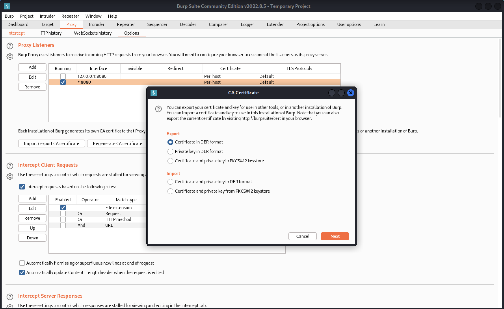
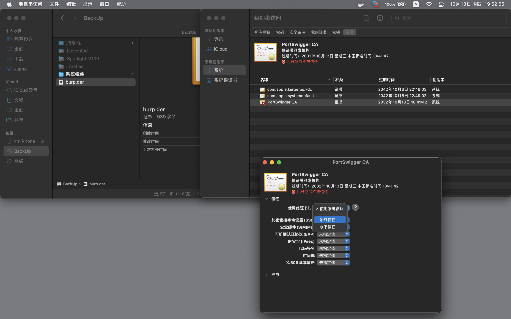
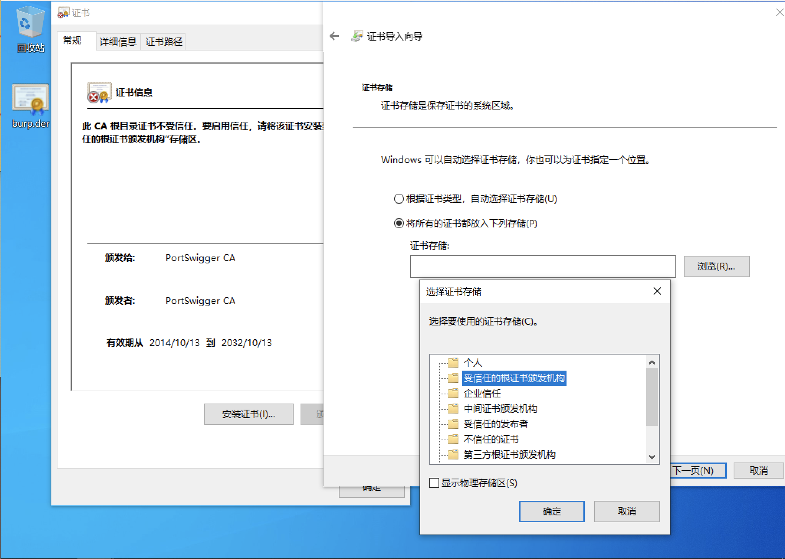
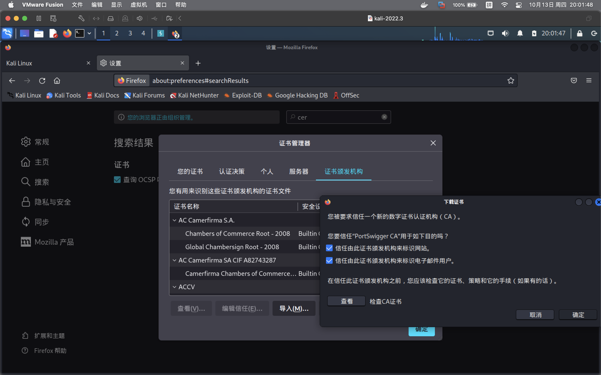

# 抓取https包

### 导出证书

从burp导出https证书



### macOS导入

双击导入钥匙串访问后，双击改为“始终信任”



### Windows导入

双击导入，将证书存储在“受信任的证书颁发机构”



### Linux下的Firefox导入



### AndroidStudiom模拟器导入

```text
示例为api 28，29+不可行
# emulator可执行文件路径
# 	macOS上通过brew安装的Android studio的emulator默认路径：~/Library/Android/sdk/emulator/emulator
# 	macOS上通过brew安装的Android studio的adb默认路径：~/Library/Android/sdk/platform-tools/adb
# 查看现有模拟器的名称
emulator -list-avds
# 以可写文件系统启动指定名称的模拟器
emulator -avd 模拟器名称 -writable-system -http-proxy 代理地址:代理端口
# 将证书转为pem格式并修改为hash名称
openssl x509 -inform DER -in burp.crt(或.der，注意后缀) -out burp.pem
hash_pem="$(openssl x509 -inform PEM -subject_hash_old -in burp.pem|head -1)"
mv burp.pem "${hash_pem}.0"
# 列出正在运行的设备
adb devices
# 获取运行设备的root权限
adb -s 设备名 root
# adb -s 设备名 shell avbctl disable-verification、adb -s 设备名 disable-verity
adb -s 设备名 remount
adb -s 设备名 push "${hash_pem}.0" /system/etc/security/cacerts
adb -s 设备名 shell chmod 644 "/system/etc/security/cacerts/${hash_pem}.0"
```