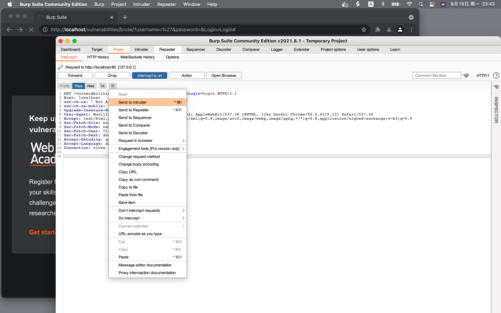
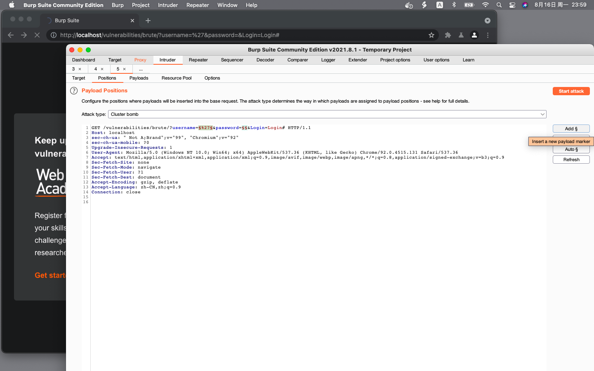
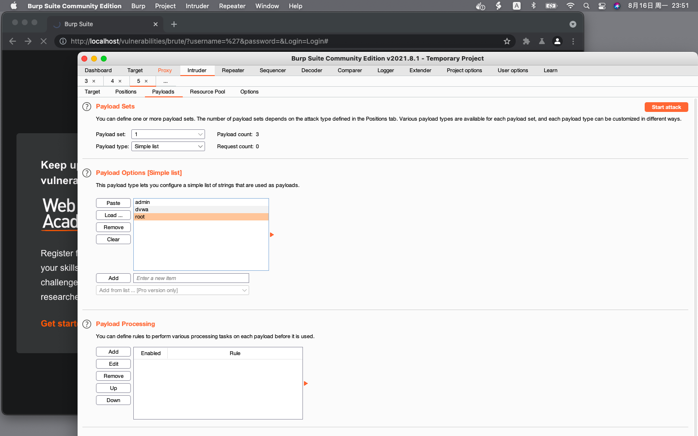
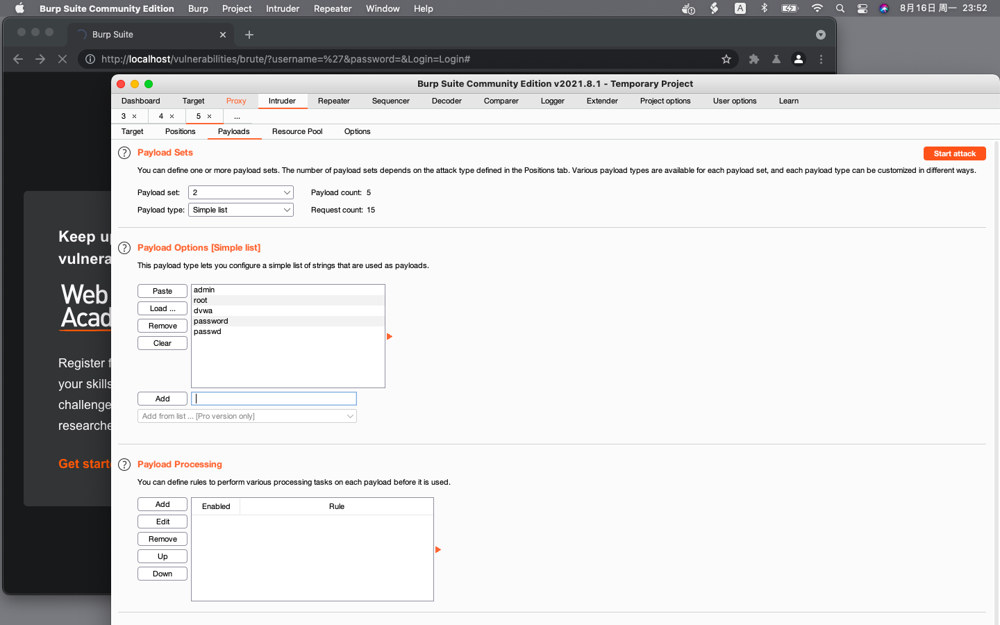
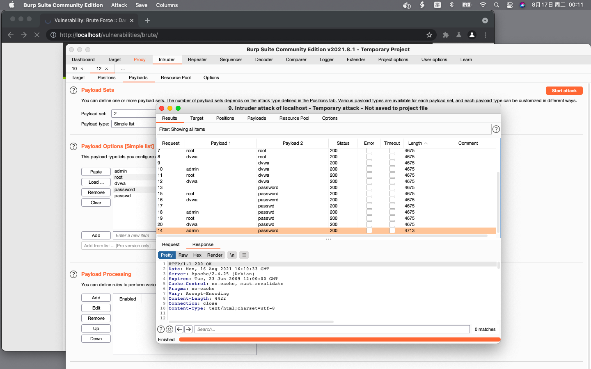

# 暴力破解（中

```text
行为：
	username：username
	password：password
反馈：
	URL地址栏：http://localhost/vulnerabilities/brute/?username=username&password=password&Login=Login#
推理：
	GET方式提交参数，无需抓包工具了，在地址栏测试
```

```text
行为：
	http://localhost/vulnerabilities/brute/?username=%27&password=password&Login=Login#
	username：’
	password：password
反馈：
	用户名或密码错误
推理：
	不存在SQL注入漏洞
```

开始暴力破解，使用Burp Suite拦截请求，将请求发送至入侵器



为username和password字段设置有效载荷标记。攻击类型选择“集束炸弹”，分别为每个有效载荷设置字典，依次遍历所有的字典



为username设置字典



为password设置字典并开始攻击



寻找结果中长度不同的，按照长度排序位于开头或结尾，那两个有效载荷就是用户名和密码

