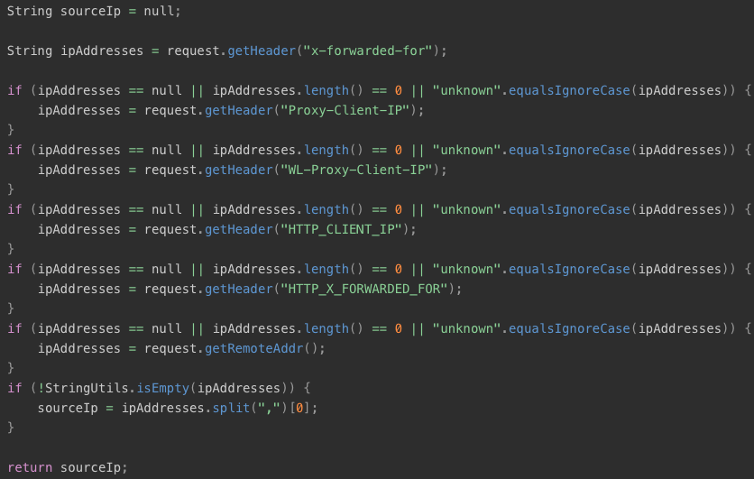

# 杂记

```text
    5.4.0版之前的php.ini中可配置的magic_quotes_gpc魔术引号，后来版本已移除这个特性。开启后会在流向数据库的字符串中的引号前加反斜杠转义，注
入时要编码绕过，像绕waf似的。
```

```text
伪造http请求头ip地址，所有这些头都是不标准的
    X-Forwarded-For: client, proxy1, proxy2
    Proxy-Client-IP
    WL- Proxy-Client-IP
    HTTP_CLIENT_IP
    X-Real-IP
```

```text
    java的request.getRemoteAddr()不可伪造，但在经过了nginx等反向代理之后，拿到的是代理的ip，因为访问请求不直接来自客户端，而是来自反向代
理。反向代理在代请求时会携带X-Forwarded-For头，并追加自己的ip，所以服务端可通过取此字段第一个非unkown值来确定客户端ip
```



```text
使用tor-resolve或proxychains host（proxychains支持UDP吗？？？），不要直接向目标发送UDP或ICMP
```

```text
nmap扫描，proxychains不支持UDP，所以需要控制参数
    -sT：指定为全连接而非SYN扫描
    -PN：跳过寻找主机名
    -n：确保不在Tor外执行DNS请求
    -sT：检测开放端口的服务和版本
    -p：扫描执行端口（逗号分隔）
nmap -sT -PN -n -sT -p 21,22,53,80,110,139,143,443,3306等等 目标IP
```

```text
靶场：墨者、sqli-lab、vulhub、vulnhub

试图找到目标站的IP地址，如果目标站允许以IP直接访问，则使用IP直接访问，因为有些WAF以DNS解析形式部署，直接使用IP访问可以绕过WAF

扫目录时以IP做目标范围更大，因为域名被配置为指向一个文件夹，访问ip访问的是存这些文件夹的目录

IIS如果设置来宾用户禁止访问，那么后门连接上去看不了目录，后门要放在有执行权限的目录，不然执行不了
```

加解密
```text
单独的加密算法有各自的特征，只能通过直观感受猜测，可尝试通过平台猜测破解：https://cmd5.com

加密方式除非拿到源码，不然不好猜

URL编码一般在做绕过时使用 

⚠️访问路径、后台入参...都可能存在某种可逆加密，sql注入时注意参数是否需要加密
```